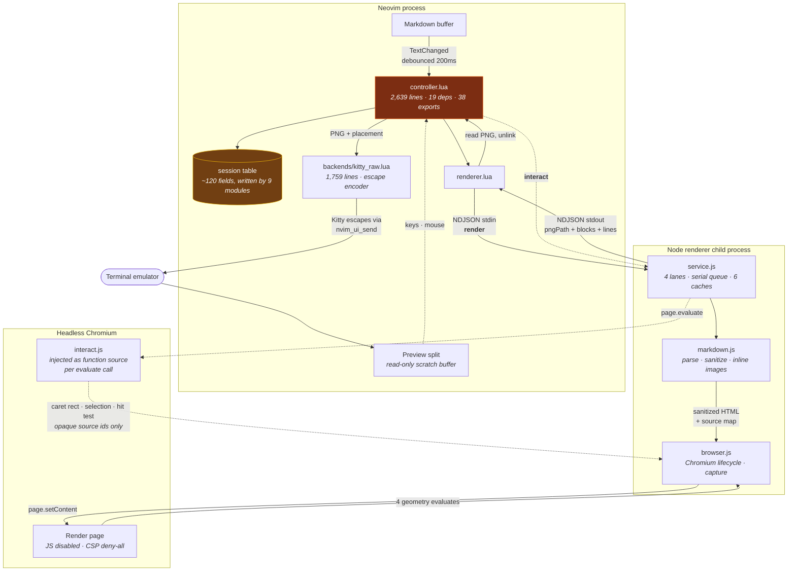
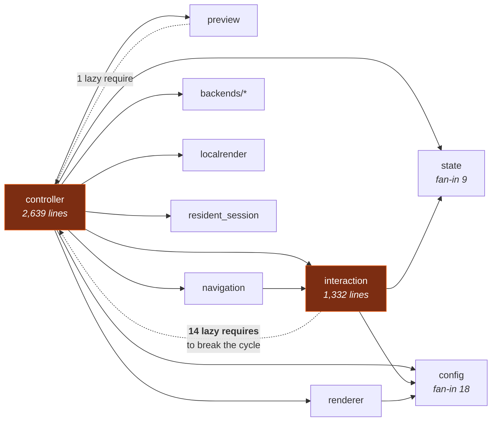

# md-viewer.nvim — architectural reassessment

## Context

`md-viewer.nvim` is one month old (first commit 2026-08-11, 40 commits, v0.3.0 shipped
2026-08-31) and has grown to ~10.5k lines of Lua, ~10.3k lines of renderer JS, and ~17k
lines of tests. v0.3.0 alone added local rendering, pane-scoped document tabs, Obsidian
wikilinks, resident mode, link-rate measurement, rendered line numbers, a statusline API
and manual split adoption.

The request was an architectural investigation, explicitly **not** a rewrite: understand
the system well enough to explain it to a newcomer, then say which complexity is
necessary, which is accidental, and how to migrate safely.

**The headline finding: this is a well-built codebase with one structural problem.**
Zero `TODO`/`FIXME`/`HACK` markers. 33–35% comment lines in the largest Lua files, and
those comments carry measurements and reproduction dates, not restatements of the code.
The renderer-side module graph is a clean DAG with no cycles.

The problem is concentrated in one place: **`controller.lua` has become the system's god
module**, and the Lua side has no layering to push back against it. Everything else in
this plan is either a consequence of that, or a small independent defect found on the way.

---

## 1. How md-viewer.nvim works

*(Phase 2 deliverable — ships to `docs/architecture.md` and the artifact in full.)*

### The one-sentence version

The preview is a **screenshot of a real browser page, drawn into a terminal split as an
image** — and because a browser is answering, the caret, selection, search and link
clicks are real DOM operations rather than reimplementations.

### The three processes

1. **Neovim (Lua)** owns windows, commands, input, and image placement. It never parses
   Markdown and never touches pixels beyond base64-encoding a PNG.
2. **A Node child process** (`renderer/`), over NDJSON on stdin/stdout, owns Markdown →
   sanitized HTML, all security policy, remote-image fetching, and the browser. It opens
   no listening port — asserted by a test against the live process, not by code review.
3. **Headless Chromium** via Playwright lays the page out and is screenshotted. The render
   page runs with **JavaScript disabled and a deny-all CSP**; the only place JS executes is
   a separate decode context for animated GIF/WebP frames.

### The path of one frame

A buffer edit fires `TextChanged` → debounced 200 ms → `controller.refresh()` →
`renderer.request()` issues a `render` over stdio. The renderer parses with markdown-it
(stamping every element with source provenance), sanitizes, inlines validated local images
as `data:` URIs, loads via `page.setContent`, measures layout in four page round-trips, and
screenshots via raw CDP `Page.captureScreenshot` into a temp PNG. Lua reads that PNG,
deletes it, and hands the bytes to a backend that chunks them into Kitty graphics escape
sequences written through `nvim_ui_send`.

### The four things that make it complicated

Load-bearing complexity — none of it gratuitous:

- **A terminal cannot host a DOM**, so every gesture is a round trip: key → renderer → DOM
  mutation → recapture → new image. The caret and selection live *in the rendered
  document*, not in the preview buffer.
- **Pixels are expensive over SSH.** One frame is ~80–300 KB; the reference link (an AWS SSM
  tunnel) carries ~0.8 MB/s. This single force shaped the architecture: fast/settle scroll
  frames, half-size moving frames, resident mode, and local rendering all exist to spend
  fewer bytes.
- **Neovim cannot measure its own link.** `nvim_ui_send` appends to a queue and returns;
  24 MB was accepted in 0.03 s on a 0.8 MB/s link. So link rate must come from a subprocess
  writing to the tty, cached per machine.
- **Terminals disagree.** iTerm2 mis-crops resident placements, WezTerm leaks memory on
  repeated placements (172 MB → 6.5 GB measured), Ghostty breaks z-order ties by image id.
  Each quirk is a profile entry backed by a reproduction.

### The four rendering models

The thing a newcomer most needs told, and currently undocumented as a concept: **there are
four ways a frame can reach the screen**, and they converge inside one 236-line function
(`controller.lua:687`).

| Model | Frame is… | Scroll costs |
|---|---|---|
| `cells` | text in a buffer | nothing (no images) |
| `viewport` (default) | one PNG per capture | a capture + a full PNG |
| `resident` (experimental) | crops of document chunks already in terminal memory | one 196-byte placement |
| `local` (experimental) | rendered beside the *terminal*; only a marker crosses SSH | one ~0.3–1 KB marker |

---

## 2. Current architecture — diagram

*(Phase 3 deliverable. Both diagrams ship to `docs/architecture.md` and the artifact.)*

### Process and data flow



### Lua module coupling — where the problem is



---

## 3. Where state lives

| Where | What | Problem |
|---|---|---|
| **The session table** | ~120 fields; constructor declares only ~57 | Written directly by **9 modules**. No accessors. `scroll_y`/`applied_scroll_y` written by 4; `preview_win` by 3. |
| **Module globals (Lua)** | 15 registries | `kitty_raw.composed` is module-global, so two resident previews break each other — a documented known limitation. |
| **Config singleton** | `config.get()` returns the **live** table, read at 59 sites incl. hot paths | `toggle_line_numbers` writes into it, bypassing validation. |
| **Node caches** | 6: markdown (64), interaction, assets (64 MiB), lanes (64), browser.documents (64), animation frames | Three LRUs of size 64 with **three different eviction cascades**; remote-image cache is unbounded for failures. |
| **The DOM** | caret, selection, find matches | Authoritative for paint; Lua holds rects and opaque ids. |
| **Terminal image memory** | base frames, tint sheets, animation frames, resident chunks | Sheets and animation frames **unbounded within a session**. |

### The counter problem

**17 distinct counters/epochs/revisions.** The critical one: `request_serial` is a **single
serial shared by four request kinds** — content render, scroll capture, resident chunk,
settle capture. The code documents the collision twice and patches it twice:

> *"Every renderer.request bumps `request_serial`, so a settle capture, a resize, a
> ColorScheme or an OptionSet is enough to stale a chunk that is in flight … the warm-up
> simply stopped at n/N and stayed there."* — `controller.lua:973`

The renderer already solved this on its own side with four **lanes**
(`content`/`capture`/`interact`/`settle`). **The Lua side has the same problem and no such
structure.**

### Find's active index has three homes

`session.find_active_index` (Lua), `interactionState.find.activeIndex` (Node), `[data-active]`
(DOM). `find_next` is dispatched with **Node's** copy, not Lua's — Lua's is write-only for
stepping purposes. Only lane admission keeps Lua's copy from being sent against a match set
that no longer exists.

---

## 4. Necessary vs accidental complexity

### Necessary — do not touch
- Three processes; Chromium for layout; PNG-over-Kitty as transport.
- The renderer's **lane model** — a genuine invention and a structural guarantee.
- All SSH byte-economics; per-terminal profiles (every quirk cites a reproduction).
- The security pipeline (SSRF blocklist with pinned resolution, magic-byte validation,
  executable-target refusal, JS-disabled render context).
- `interact.js` being self-contained: Playwright serializes function source, so it
  structurally cannot reference module scope.
- The Lua↔JS Kitty chunker duplication — 48 lines, declared a cross-language contract on
  *both* sides, and pinned by a real golden fixture. This is how to do a cross-language port.

### Accidental — the actual targets
1. **`controller.lua` holds nine unrelated concerns.** Internally well-ordered (seams are
   already banner-delimited) but 2,639 lines with 19 dependencies.
2. **The `controller ↔ interaction` cycle**, worked around by 14 lazy requires. All 14 call
   frame-presentation functions. **A missing module, not a naming problem.**
3. **One `request_serial` for four request lanes.**
4. **`backend.name ==` used as a capability check at 42 sites** — 26× `"cells"` (really
   `is_graphical`), 16× `"kitty_raw"` (really five distinct unnamed capabilities). The
   codebase already does this correctly once, via `overlay_encoding` as a profile field.
5. **The `kitty_raw` presenter seam is declared universal and isn't** — 11 functions bypass
   it with direct `send()`. That is *why* resident mode and animation are structurally
   disabled in local mode.
6. **Local mode is threaded, not seamed: 31 branch sites across 8 core modules**, plus
   ~210 lines of local-only implementation inside `controller.lua`/`renderer.lua`.
   `apply_surface` (61 lines) is a parallel `apply_image`. `preview.lua` and `animation.lua`
   are genuinely clean; `controller.lua` and `renderer.lua` are not.
7. **Geometry math written four times**, plus four verbatim-duplicated blocks between
   `overlay_apply` and `animation_apply`.
8. **In-page duplication beyond what the evaluate boundary forces**: the character-space
   builder twice (~40 lines each), the cell-probe three times, the TreeWalker four times,
   `unwrapFindMarksInPage` verbatim twice. The quad→band clustering duplicated between
   `interact.js` and `source-map.js` is **not** forced by the boundary.
9. **~30 session fields exist only for `:MdViewerDebug`**, with 35 lines of telemetry inline
   in `apply_image`.

### Orphaned, not accidental — a product question
0.3.0 removed click-drag selection and plain click-to-source. That stranded live code:
- **`provenance.js` (612 lines)** buys one field, `precision`, whose only consumer is
  `:MdViewerDebug`. Nothing in caret motion, selection, find, or link activation depends on
  it. Excellent, correctly-reasoned code that the feature it served was removed around.
- **`hit_test` has no production caller**; `CARET_STRATEGIES`/`strategy` is never sent;
  `clickCount` is always `1`.

Not proposing removal — raising it, the way resident mode was raised.

### Boundaries that are good — preserve them
- **Lua ↔ renderer.** Markdown, HTML, sanitization and the source map **never leave Node**;
  Lua receives geometry and opaque ids. Genuinely clean.
- **`resident.lua`** is pure arithmetic with no `vim.api`, so its invariants are tests.
- **`state.source_window()` vs `session.source_win`** — two deliberately different questions.
- **`main.js` vs `service.js`** — "how requests arrive" vs "what a request means".
- **Local mode's push-only asset path** — the helper never gets a path request channel.

### Boundaries that should change
`controller ↔ interaction` (cycle) · `backend.name` as a type tag → capability flags ·
the presenter seam → actually universal · config as a live global → snapshot per session.

---

## 5. Target architecture

Not a rewrite. Same processes, same protocol, same behavior. The Lua side gains layering:

```
commands / autocmds        ← event wiring only, no logic
        ↓
controller                 ← orchestration: open/close/refresh/retarget
        ↓
history · tabs · scroll · resident · occlusion    ← peer feature modules
        ↓
presenter                  ← NEW: the frame on glass (base, surface, overlay, caret)
        ↓
session (accessors)        ← LATER: typed access to what is now a raw table
        ↓
backends (capability-flagged) · renderer · state · config
```

Two new modules carry the idea:

- **`presenter.lua`** — everything that decides what is on the glass: `apply_image`,
  **`apply_surface`**, `display_interact_result`, `display_selection_overlay`,
  `display_caret_overlay`, `restore_clean_base`, `clear_image`. This is exactly the set
  `interaction.lua` reaches back for at all 14 cycle sites, **and** where local mode's
  parallel implementations live. Extracting it both breaks the cycle and gives local mode a
  real seam: `controller → presenter ← interaction`.
- **`lanes.lua`** — port the renderer's lane model, replacing the single `request_serial`.
  The design already exists and is proven in `lanes.js`.

---

## 6. Migration plan

Ordering is driven by the measured test-safety analysis below, which **inverts the intuitive
ranking**: moving code between modules is cheap here; touching the session's field surface
and extracting untestable code are expensive.

### Test-safety ground truth (measured)
- The Lua suite does **zero module mocking** — no `package.loaded` substitution anywhere in
  39 case files. Tests call public entry points against **real** buffers and windows.
  → **Moving code between modules is cheap.**
- Tests read/write **87 distinct session fields** directly (`preview_win` 50×,
  `applied_scroll_y` 34×, `backend` 28×, `image_id` 25×).
  → **Changing the session's field surface is expensive — the tests are the oracle you'd be
  editing in the same commit as the subject.**
- 11 test files hand-roll fake backend tables whose only identity is `name = "kitty_raw"`.
  → Capability flags break each one **loudly**, which is good.
- Only **10 of 34 autocmd events** are ever fired by a test. `TextChanged*` — the
  live-preview trigger — is among the untested.
  → **Autocmd extraction is the most dangerous move and must come last.**
- `pump_resident` and three sibling paths carry `KEEP_IN_MIND: unreached on every host`.
  → **You cannot test what you extract.** Resident extraction is high-risk, not a cheap win.
- The suite has **no single-case runner**, runs alphabetically in one shared Neovim, aborts
  on first failure, and has a load-order dependency (`controller_local.lua` must sort before
  `local_transport.lua`). Iterating on a large refactor is impractical until this is fixed.

### Phase 0 — independent defects found during the investigation
Small, unrelated to the refactor, worth landing first.
1. **`tests/lua/cases/health.lua`**: `auto_cfg` is block-local at `:87`/`:171` but referenced
   at `:305`, `:316`, `:332`, `:343` → resolves to a nil global, so `diagnose` falls back to
   `config.get()` and **8 assertions silently test live config** instead of the intended one.
2. **Local mode — `presented` over-confirms.** It fires for *every* injected transaction
   including upload-free ones, so the deletion transactions `apply_surface` emits can flip
   `local_frame_confirmed = true` before the frame's own pixels resolve, defeating the guard
   at `controller.lua:464`/`:1990`.
3. **Local mode — an overlay-sheet upload can evict a pending frame.** The injector treats
   any upload-bearing marker as a surface transaction and supersedes the previous entry,
   dropping its placements and raising `lastSurfaceSeq`. Reachable because
   `display_selection_overlay` — unlike `display_caret_overlay` — doesn't check
   `local_frame_confirmed`.
4. **Marker size bounds disagree 16×** — `markers.js` declares 64 KB, `stream-parser.js`
   enforces 4096 and on overflow flushes the marker bytes *verbatim to the terminal*; the Lua
   emitter checks neither. A frame with many occlusion cut-outs is silently lost while the
   Lua counter records it as emitted.
5. **SECURITY.md is wrong about the token.** It states the per-run token "travels only over
   the control socket's hello, **never through the terminal stream**." Every marker embeds
   `t=<token>` and is written to the terminal stream, readable by anything observing the pty.
   Fix the claim (the intended meaning is presumably about distribution direction).
6. `localrender.fallback_notified` is never re-armed, so the 2nd+ demotion in a session is
   silent — while health warns that recurring demotions mean flapping.

### Phase A — de-duplication and deletions (no behavior change)
7. Delete confirmed-dead state: `debug.log` (no callers), `visual_columns`, `obsolete_files`,
   `selection_render_in_flight/_pending`, the empty-bodied `WinLeave` autocmd. Leave
   everything marked `KEEP_IN_MIND` alone — CONTRIBUTING makes that a product call.
8. Extract the timer-teardown list written verbatim twice (`controller.lua:1366`, `:1550`).
9. **De-duplicate the drawn-pixel geometry** (`kitty_raw.lua:783`, `:1165`,
   `interaction.lua:186`, `animation.lua:148`). Safer than it looks — the golden byte-stream
   plus four tests with numbers chosen to differ from the wrong answer will catch a mistake.
   **Caveat: the sites are not identical** (`math.ceil` vs `math.max` rounding); unify
   deliberately, not blindly.
10. Move `apply_image`'s 35 lines of telemetry to `metrics.record_frame()`.

### Phase B — extract the cohesive blocks out of `controller.lua`
Already banner-delimited; no test mocks module identity.
11. **`history.lua`** ← `controller.lua:1693-1860`. Safest of all — `history.lua` drives it
    through the public API. **Collapse the pane/session double bookkeeping to one home while
    moving it** (currently reconciled by hand at 5 sites).
12. **`presenter.lua`** ← `controller.lua:52-65, 111-333, 335-613`, including `apply_surface`.
    The keystone: breaks the `controller ↔ interaction` cycle *and* seams local mode. Convert
    all 14 lazy requires in `interaction.lua` to one top-level require. Well covered —
    `controller.lua:408-563` and `caret.lua:356-477` assert every refusal branch.
13. **`occlusion.lua`** ← `controller.lua:67-109` + `1945-2094`. Medium risk: `reconcile_resident`
    has no direct test, the `force` flag is only reached via `CmdlineEnter`, and `each_session`
    has 14 call sites. Forces `update_occlusion`'s dual-meaning return value to be named.

Target after Phase B: `controller.lua` ≈ 1,100 lines.

### Phase C — interface fixes
14. Replace 42 `backend.name ==` checks with capability flags (`is_graphical`,
    `accepts_exclusions`, `needs_statusline_guard`, `needs_ui_poll`, `places_raw_images`).
    Model on the existing `overlay_encoding` profile field; fix the 11 fake backend tables in
    the same commit. **Watch the `cells` direction** — those paths are only ever reached *with*
    `cells` in tests, so a flag defaulting wrong for `cells` changes behavior tests accept.
15. Make the `kitty_raw` presenter seam universal — route the 11 direct `send()` calls through
    it. This is what would let resident mode and animation work in local mode rather than being
    disabled there.
16. Snapshot config per session at open instead of 59 live `config.get()` reads; stop
    `toggle_line_numbers` writing into the user's config table.

### Phase D — needs new test infrastructure first
17. **Build the missing harness** (see below), then port the renderer's lane model to Lua
    (`lanes.lua`), replacing the shared `request_serial`.
18. **`resident_controller.lua`** ← `controller.lua:931-1171`. Deferred to here, not Phase B:
    the code is unreachable on every validated host, so extraction cannot be verified by the
    suite. Gate on `scripts/resident/drive.lua` passing.

    **Correction (2026-09-14):** this line and the verification note below both said the
    driver needs a real terminal. It does not. The script's own header and
    `scripts/README.md` both say it needs "no display and no graphics terminal — only Node
    and a Chrome/Chromium": it spawns a child Neovim with a *faked* Kitty-capable terminal
    and records the byte stream instead of drawing it. The claim cost one session, which
    read the gate here, believed itself blocked, and stopped. Run it plain and with
    `--slow-chunks=2000`, which is the knob that exercises the warm-up.
19. Only then `autocmds.lua` — 24 of 34 events untested, ordering assumptions documented only
    in prose, and three events have two handlers each whose registration order is behavioral.

### Test infrastructure the dangerous phases need
- **An autocmd manifest + driver**: enumerate `nvim_get_autocmds({group="md-viewer"})` and
  assert the set (catching *deleted* registrations, which nothing does today); fire each event
  against a fixture session; record callback order for the six double-registered events.
- **A single-case runner** (`MD_VIEWER_TEST_FILTER`) and per-case teardown assertions.
- **A session-shape contract** — assert the exact key set, and categorize "frame on screen"
  (`frame_scroll_y`, `image_id`, `last_placement`, `clean_image_*`) vs "target"
  (`applied_scroll_y`, `scroll_y`). This is the oracle a session accessor layer would need.
- **A generated `tests/fixtures/shared-constants.json`** emitted by the Node side (viewport
  clamps 320/240/1920/1440, `MAX_REGION_PIXELS`, `MAX_REGION_HEIGHT_PX`, `device_scale_factor`
  bounds, every `REGION_*`/`STALE_*`/`INTERACT_*` code, the local protocol version) with a Lua
  case asserting agreement. **This one fixture closes 5 of the 8 uncaught cross-language
  drifts**, and the pattern already exists twice and works.
- **Skip-on-no-browser for the Lua suite** — `debug.lua` and `health.lua` hard-wait 30 s on a
  real Chromium while the Node suite skips, contradicting CONTRIBUTING.

### Explicitly NOT recommended
- **No rewrite.** Nothing supports one. The renderer is a clean DAG; the Lua side needs
  layering, not replacement.
- **No session accessor layer** until the shape contract exists. 87 fields × hundreds of test
  references makes it the most expensive change available for the least behavioral gain.
- **No file reorganization for tidiness.** Every move above pays for itself in a named coupling.

---

## 7. Deliverables

1. **`docs/architecture.md`** — rewrite from 153 lines into the full contributor-facing
   document: the four rendering models, the state map, the counter/lane story, both diagrams.
2. **A published artifact** — same content as a browsable page with rendered diagrams.
3. The Phase 0–D work above, as separate PRs.

---

## 8. Verification

- `make test` green after **every** step (39 Lua cases; 32 Node files, 17 browser-gated).
- `stylua --check build.lua lua/ plugin/ tests/lua/` — CI enforces it.
- For Phase B step 12 and all of Phase C, run the harness CONTRIBUTING names as mandatory for
  placement/interaction/overlay changes:
  `nvim --headless -u NONE -i NONE -l scripts/overlay/live/drive.lua`
- For Phase C steps 14–15, work `scripts/manual-checklist.md` on a real terminal — the headless
  suites cannot see a pixel.
- Phase D step 18 is gated on `scripts/resident/drive.lua` (needs Node + Chromium; **not** a
  real terminal — see the correction under step 18); steps 17 and 19 are gated on the new
  harness existing and passing first.
